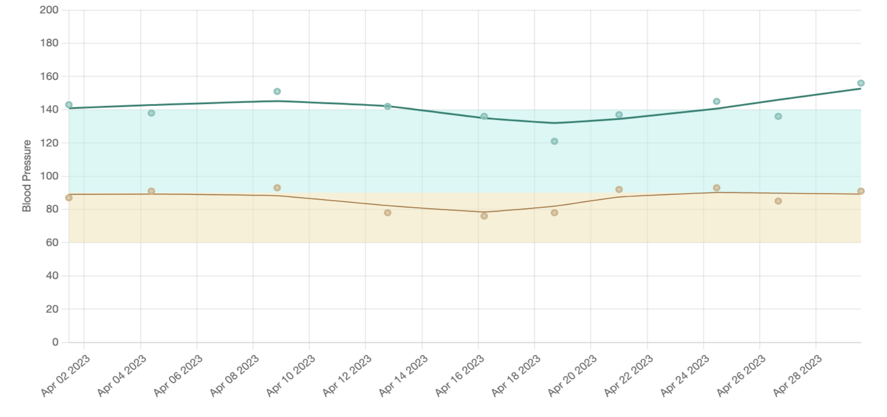

```{r setup, include=FALSE}
options(htmltools.dir.version = FALSE)
knitr::opts_chunk$set(warning = FALSE, message = FALSE, echo=FALSE)
library(tidyverse)
library(janitor)
library(gt)
library(ggtext)
library(gganimate)
library(gifski)
library(snakecase)
library(patchwork)
```

class: center, middle
background-image: url(img/background2.jpeg)
background-size: cover

## About Me

.pull-left[
```{r me, out.width="80%"}

```
]

.pull-right.left[
<strong>Amy Yates</strong>

Research Engineer 3

Oregon Health & Science University

]

???

Talk about my experience with R. I have used it for the last few years, but it was all self-taught and very sporadic, so I never had time for any deep dives. I was comfortable with installing packages, using libraries, and the basic syntax of the Tidyverse, but there were a lot of things I'd only explored shallowly like visualization, RMarkdown, and even the principles behind tidying data.

---

background-image: url(img/background2.jpeg)
background-size: cover

## Data Inspiration - Let's Get Healthy

The [Let's Get Healthy](https://www.letsgethealthy.org/explore-the-data/cardiovascular/) program collected anonymous data at health fairs throughout Oregon. They tracked a few demographics and collected general health information for over 9000 participants, including blood pressure:

```{r data}
gt_preview(read_csv("data-raw/simulated-bps.csv", na = "NULL"))
```

.small[<em>Note: To protect health information, this is a simulation of the data collected at these fairs and does not represent real participants.</em>]
---

background-image: url(img/background2.jpeg)
background-size: cover

## Visualization Inspiration - COACH

[The COACH Application for Hypertension Management](https://digital.ahrq.gov/ahrq-funded-projects/collaboration-oriented-approach-controlling-high-blood-pressure-coach) provides clinical decision support and home blood pressure monitoring for patients. Blood Pressure observations for an individual:

```{r coach, out.width="100%"}

```

.small[<em>Normal range denoted by shaded rectangles</em>]

---

background-image: url(img/background2.jpeg)
background-size: cover

## Tidying the Data Source (Cleaning)

```{r raw, echo=TRUE}
# Read the raw data, keeping only reasonable BP values
bps_raw <- 
 read_csv("data-raw/simulated-bps.csv") %>%
  clean_names() %>% 
  filter(is.numeric(systolic) & systolic > 70 & systolic < 200) %>% 
  filter(is.numeric(diastolic) & diastolic > 40 & diastolic < 130)
```

```{r rawtable}
gt_preview(bps_raw)
```

---

background-image: url(img/background2.jpeg)
background-size: cover

## Tidying the Data Source (Pivoting)


```{r tidy, echo=TRUE}
# Pivot on systolic/diastolic readings
bps_tidy <- bps_raw  %>% 
  pivot_longer(cols = c(systolic, diastolic), 
               names_to = "measurement_type")
```


```{r tidytable}
gt_preview(bps_tidy)
```

---

background-image: url(img/background2.jpeg)
background-size: cover

## Summarizing County Data

```{r countyavg, echo=TRUE}
average_by_county <-
  bps_tidy %>% 
  group_by(measurement_type, fair_county) %>% 
  summarize(mean_value = round_half_up(mean(value)))
```


```{r avgtable}
gt_preview(average_by_county)
```

---

background-image: url(img/background2.jpeg)
background-size: cover

## Initial Visualization

```{r county1}
average_by_county %>% 
  ggplot(aes(x=fair_county, y=mean_value, color=measurement_type)) +
  geom_point() +
  labs(title = "Mean Systolic and Diastolic Blood Pressure by County in Oregon",
       subtitle = "Measurements collected at health fairs were in the normal range.") +
  scale_y_continuous(limits = c(0,150)) +
  theme_minimal() +
  theme(axis.title = element_blank(),
        legend.position = "none")

```

---

background-image: url(img/background2.jpeg)
background-size: cover

## Improved Visualization

```{r county2}
diastolic_target <- "#F4E1AC"
systolic_target <- "#ACF2E9"
diastolic_value <- "#CFB289"
systolic_value <- "#7EC2B9"

average_by_county %>% 
  ggplot(aes(x=fair_county, y=mean_value, color=measurement_type)) +
  # Giving these rectangles a small slice of the data allows the transparency to work: https://stackoverflow.com/questions/17521438/geom-rect-and-alpha-does-this-work-with-hard-coded-values
  geom_rect(data=average_by_county[1,], xmin=0, xmax=Inf,ymin=60, ymax=85, alpha=0.3, fill=diastolic_target, color=NA) +
  geom_rect(data=average_by_county[1,], xmin=0, xmax=Inf, ymin=90, ymax=130, alpha=0.3, fill=systolic_target, color=NA) +
  geom_point(size=8) +
  labs(title = "Mean <span style='color:#7EC2B9'>Systolic</span> and <span style='color:#CFB289'>Diastolic</span> Blood Pressure by County in Oregon",
       subtitle = "Measurements collected at health fairs were in the normal range.") +
  scale_color_manual(values=c(
    "systolic" = systolic_value, "diastolic" = diastolic_value
  )) +
  scale_y_continuous(limits = c(0,150)) +
  geom_text(aes(label=mean_value), color="white", size=3, fontface="bold") +
  theme_minimal() +
  theme(plot.title = element_markdown(),
      axis.title = element_blank(),
      axis.text.x = element_text(angle = 60, vjust = 1, hjust=1),
      legend.position = "none")

```

---

background-image: url(img/background2.jpeg)
background-size: cover

## Generalize the Plot for Other Variables
.small-code[
```{r generalize, echo=TRUE}
plot_it <- function(data, col_name) {
  display_name <- data %>% select({{col_name}}) %>% colnames()
  display_name <- to_title_case(display_name)
  
  mean_by_col <- data %>% 
    group_by(measurement_type, {{col_name}}) %>% 
    summarize(mean_value = round_half_up(mean(value))) %>% 
    ungroup()

  mean_by_col %>% 
  ggplot(aes(x={{col_name}}, y=mean_value, color=measurement_type)) +
  # Giving these rectangles a small slice of the data allows the transparency to work:
  # https://stackoverflow.com/questions/17521438/geom-rect-and-alpha-does-this-work-with-hard-coded-values
  geom_rect(data=mean_by_col[1,], xmin=0, xmax=Inf, ymin=60, ymax=85, 
            alpha=0.3, fill=diastolic_target, color=NA) +
  geom_rect(data=mean_by_col[1,], xmin=0, xmax=Inf, ymin=90, ymax=130, 
            alpha=0.3, fill=systolic_target, color=NA) +
  geom_point(size=8) +
  labs(title = str_glue("Mean <span style='color:#7EC2B9'>Systolic</span> and <span style='color:#CFB289'>Diastolic</span> Blood Pressure by {display_name} in Oregon")) +
  scale_color_manual(values=c(
    "systolic" = systolic_value, "diastolic" = diastolic_value
  )) +
  scale_y_continuous(limits = c(0,150)) +
  geom_text(aes(label=mean_value), color="white", size=3, fontface="bold") +
  theme_minimal() +
  theme(plot.title = element_markdown(),
        axis.title = element_blank(),
        axis.text.x = element_text(angle = 60, vjust = 1, hjust=1),
        legend.position = "none")
  
  
}
```
]

---

background-image: url(img/background2.jpeg)
background-size: cover

## Blood Pressure by Race and Ethnicity


```{r patches, fig.show = 'hide', echo=TRUE}
bps_tidy %>% plot_it(race) / bps_tidy %>% plot_it(ethnicity)
```


```{r ref.label = 'patches', echo = FALSE}
```

---

background-image: url(img/background2.jpeg)
background-size: cover

## Conclusion

```{r bye, echo=TRUE}
mystery <- read_csv("data/mystery.csv")
plot <- mystery %>% ggplot(aes(x=x, y=y)) + 
  geom_point(colour = 'red', size = 2,
             aes(group = row)) +
  ylim(c(0,10)) +
  theme_void() +
  transition_manual(level, cumulative = TRUE)
```

---

.center.middle[
```{r thanks}
animate(plot, 
        renderer = gifski_renderer(loop=TRUE), 
        rewind = FALSE, fps = 35, end_pause = 10)
```
]